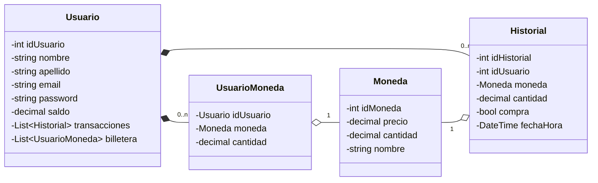

### Diagrama de clases

```mermaid
classDiagram
    direction LR
    Usuario *-- "0..n" UsuarioMoneda
    UsuarioMoneda o-- "1" Moneda 
    Usuario *-- "0..n" Historial
    Moneda "1" --o Historial

    class Usuario {
        -int idUsuario
        -string nombre
        -string apellido
        -string email
        -string password
        -decimal saldo
        -List~Historial~ transacciones
        -List~UsuarioMoneda~ billetera
        
    }

    class Moneda {
        -int idMoneda
        -decimal precio
        -decimal cantidad
        -string nombre
    }

    class UsuarioMoneda {
        -Usuario idUsuario
        -Moneda moneda
        -decimal cantidad
    }

    class Historial {
        -int idHistorial
        -int idUsuario
        -Moneda moneda
        -decimal cantidad
        -bool compra
        -DateTime fechaHora
    }
```